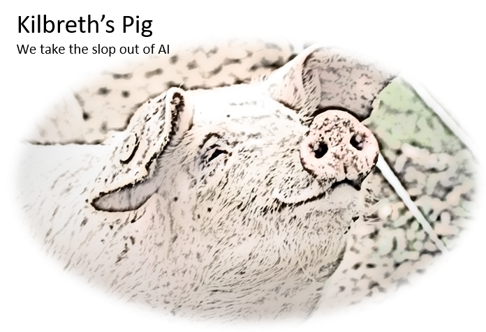

<table>
  <tr>
    <td width="40%">
      
    </td>
    <td width="70%">
      <h1>Kilbreth's Pig</h1>
      

        Kilbreth’s Pig is a Python-based system designed to validate academic citations by extracting
references from a PDF, identifying key metadata, querying authoritative databases, and
generating a structured validation report. The system addresses a growing problem: AI-
generated citations often contain fabricated or partially incorrect information. Kilbreth’s Pig
acts as a filter—much like the pig in the family story that inspired the program—sorting valuable
information from slop.
      

    </td>
  </tr>
</table>

This document outlines the full architecture goals of the system, including three deployment options:

- A fast, interactive web interface using GitHub Pages and an external backend

- A fully in-browser version using WebAssembly-based Python

- A GitHub Actions–driven workflow for reproducible, version-controlled validation

All options rely on a shared core Python library that performs deterministic, API-driven
validation. As a founding member of Boondoggle Research, we will see how far we get.

### Introduction
AI tools increasingly generate citations that appear plausible but are entirely fabricated. These
hallucinated references pose risks to academic integrity, peer review, and scientific
communication. Kilbreth’s Pig is designed to mitigate this problem by validating citations
against real-world data sources such as Crossref, PubMed, and arXiv.
The system is modular, extensible, and deployable in multiple environments. This document
describes the architecture, deployment options, and technical requirements for the project.

### Core Python Library Architecture
The Python package kilbreths_pig (eventually to be imported as kp) is the foundation of all deployment models.
It provides deterministic, API-driven citation validation.

### Package Structure

kp/

__init__.py

pdf.py

bibliography.py

search.py

validate.py

report.py

### Module Responsibilities
#### pdf.py
- Extracts text from PDF files

- Handles page iteration and text normalization
#### bibliography.py
- Locates the References/Bibliography section

- Splits into individual citation entries

- Extracts key fields (DOI, year, title, authors)
#### search.py
- Queries authoritative external APIs

- Crossref

- PubMed (optional)

- arXiv (optional)

- Returns structured metadata
#### validate.py
- Compares citation fields to retrieved metadata

- Computes similarity scores

- Determines match status
#### report.py
- Builds structured JSON reports

- Generates human-readable summaries
